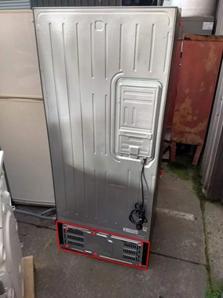
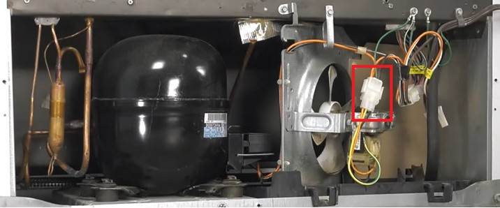
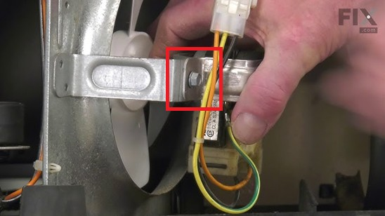
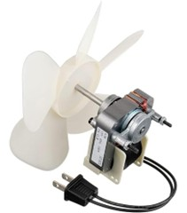

How To Change a GE Refrigerator Condenser Fan

- Unplug the refrigerator from power outlet.
- Unscrew the cover panel on the lower rear of refrigerator (see figure 2).

Figure 1. The protective cover panel is on the lower rear of the refrigerator. The panel and approximate location of screws are highlighted in red. (source: <https://www.whybuy.com.au/blog/can-you-move-a-fridge-laying-down/>)

- Unplug the wire harness to access the condenser mounting bracket.

Figure 2. Lower rear of refrigerator with protective cover panel removed. The wire harness is highlighted in red. (source: <https://www.youtube.com/watch?v=4WEpgipx_z0>)

- Separate the fan blade from the condenser motor by pulling the fan blade away from the condenser motor.
- Unscrew the six-point screws on the mounting bracket.

Figure 3. The red square shows the location of one six-point mounting bracket screw. A second screw is on the opposite side of the mounting bracket. (source: <https://www.youtube.com/watch?v=4WEpgipx_z0>)

- Remove the mounting bracket and condenser motor from the refrigerator.
- Secure the replacement condenser motor into the groove of the mounting bracket.
- Reattach the mounting bracket and condenser motor using the six-point screws removed in step 5.
- Attach the fan blade to the condenser motor. The fan blade should fit snugly.

Figure 4. The fan blade should fit snugly onto the condenser motor. (source: <https://www.amazon.com/106mmx24mmx72mm-4-2x0-9x2-8-Accessories-Refrigerator-Condenser/dp/B0CKR3ZC5T>)

- Reconnect the wire harness.
- Use screws to reattach the protective cover panel. See Figure 1 for screw locations.
- Plug the refrigerator into the power outlet.
- Confirm that cold air is blowing into the refrigerator.
